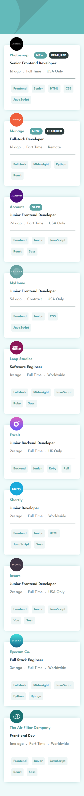
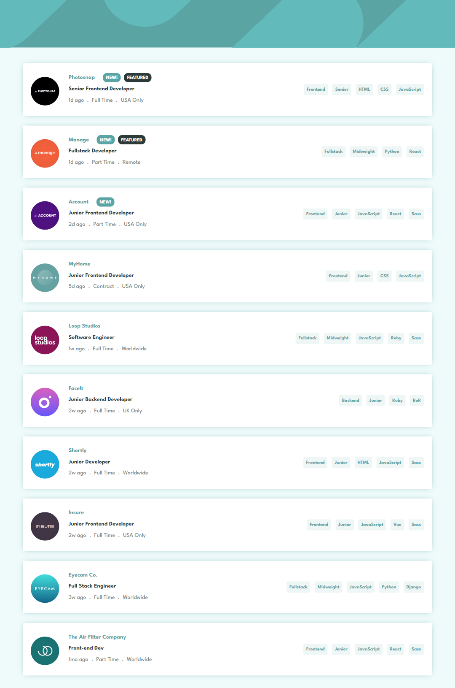
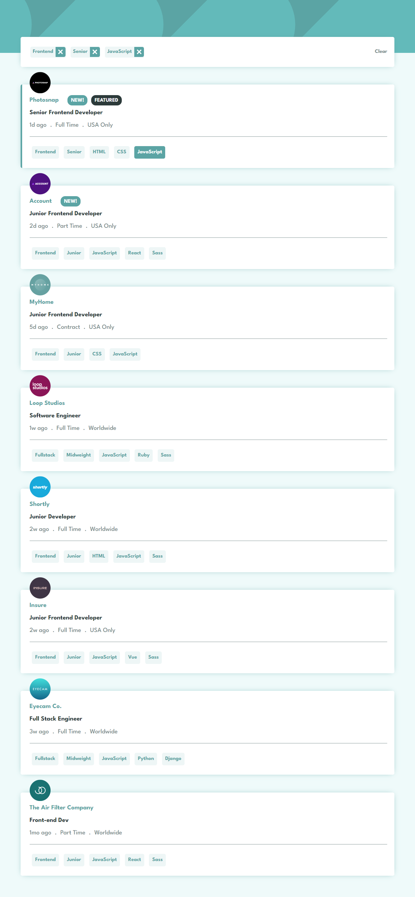

# Frontend Mentor - Job listings with filtering solution

This is a solution to the [Job listings with filtering challenge on Frontend Mentor](https://www.frontendmentor.io/challenges/job-listings-with-filtering-ivstIPCt). Frontend Mentor challenges help you improve your coding skills by building realistic projects.

## Table of contents

- [Overview](#overview)
  - [The challenge](#the-challenge)
  - [Screenshot](#screenshot)
  - [Links](#links)
- [My process](#my-process)
  - [Built with](#built-with)
- [Author](#author)
- [Acknowledgments](#acknowledgments)

## Overview

### The challenge

The designs were created to the following widths:

- Mobile: 375px
- Desktop: 1440px

  Users should be able to:

- View the optimal layout for the site depending on their device's screen size
- See hover states for all interactive elements on the page
- Filter job listings based on the categories
- i used the [data.json](./data.json) file to pull the data and then dynamically add the content.
- To add a filter, user needs to click on the tablets on the right-side of the listing on desktop or the bottom on mobile.

### Screenshot

### Links

- Solution URL: [https://github.com/MonaElshikh/static-job-listings]
- Live Site URL: [https://monaelshikh.github.io/static-job-listings/]

## My process

### Built with

- Semantic HTML5 markup
- CSS custom properties
- Flexbox
- Mobile-first workflow
- Typescript

## Author

- Frontend Mentor - [@MonaElshikh](https://www.frontendmentor.io/profile/MonaElshikh)

## Acknowledgments

Thanks a lot frontendmentor for your support :)
